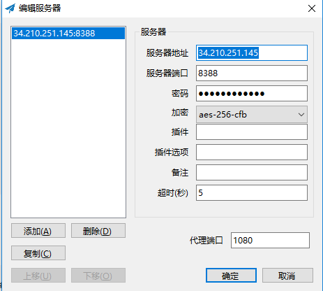

# 第一节 shadowsocks代理
# 搭建shadowsocks代理实现翻墙
  ** 安装shadowsocks服务端 **
  ** 配置shadowsocks服务端 **
  ** 配置shadowsocks客户端 **

## 1、安装shadowsocks服务端
```
[root@gitbook books]#cd /opt
[root@gitbook books]#curl https://pypi.python.org/packages/source/p/pip/pip-1.5.4.tar.gz -O
[root@gitbook books]#tar -xzvf pip-1.5.4.tar.gz
[root@gitbook books]#cd pip-1.5.4/
[root@gitbook books]#python setup.py install
[root@gitbook books]#yum install python-pip
[root@gitbook books]#pip install shadowsocks
```
## 2、配置shadowsocks服务端
在/etc目录下创建  shadowsocks.json 文件，将下面的内容放进去：
[root@gitbook books]#vim /etc/shadowsocks.json
```
{
"server":"0.0.0.0",
"server_port":8388,
"local_port":1080,
"password":"linux211.com",
"timeout":600,
"method":"aes-256-cfb"
}
```
只需要修改密码和加密方式即可

然后启动运行 shadowsocks服务器端：
```
[root@gitbook books]#ssserver -c /etc/shadowsocks.json -d start #启动
INFO: loading config from /etc/shadowsocks.json
2017-10-01 14:38:20 INFO     loading libcrypto from libcrypto.so.10
started
```
`[root@gitbook books]#ssserver -c /etc/shadowsocks.json -d stop` #停止
`[root@gitbook books]#ssserver -c /etc/shadowsocks.json -d restart` #重启

## 配置shadowsocks客户端

